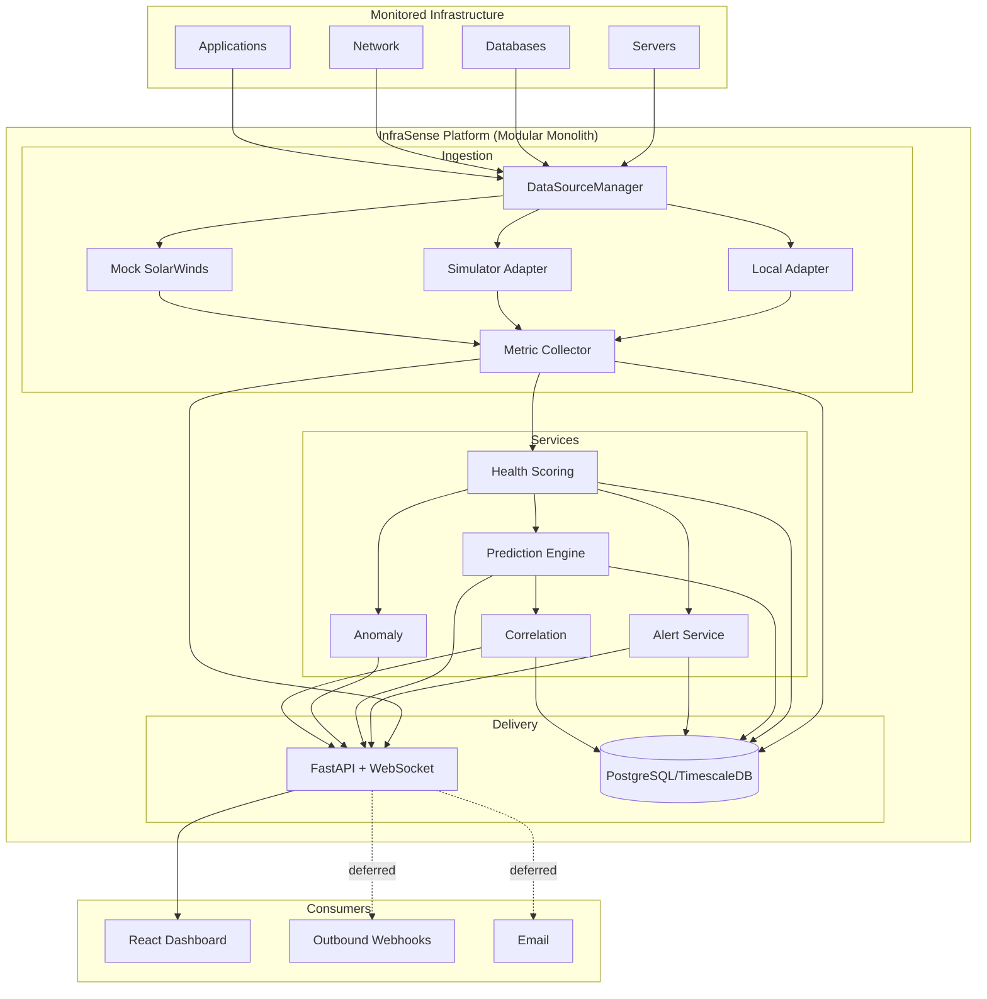
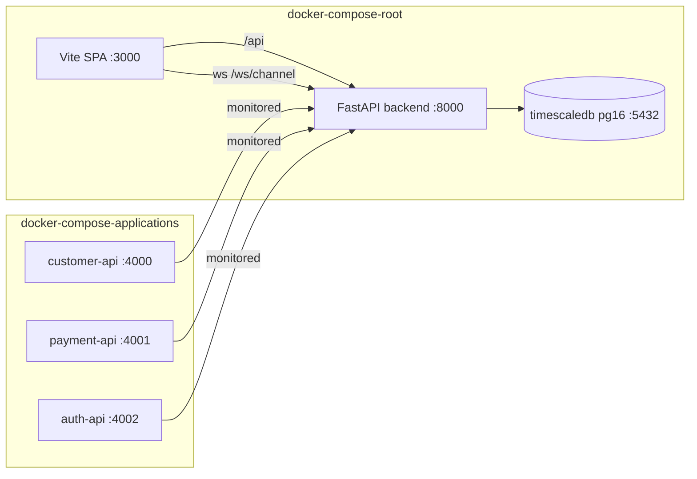

# Architecture Spine — InfraSense Health Analytics Platform

> Updated 2026-08-17: re-derived from the implemented `health-analytics-platform` codebase, then amended after the Reviewer Gate. The original event-driven microservices target is deferred enterprise evolution; this spine ratifies the modular monolith that is built today.

## Design Paradigm

**Modular monolith.** One FastAPI process (`InfraSense API` v2.0.0) contains the whole platform, decomposed along seam lines so services can split out later once entity ownership is exclusive (AD-10):

```
routers/   → API boundary, HTTP + WebSocket exposure (no business logic)
services/  → business logic (health, prediction, alert, correlation, anomaly, notification)
data_sources/ → pluggable adapters behind a single manager (collection side)
models/    → SQLAlchemy persistence (shared single schema)
```

Two runtime write paths exist — the in-process MetricCollector (metric rows + component registration) and the background updater thread (health, alerts, predictions). Real-time delivery to the UI is WebSocket push. No external message bus, no separate services today.

## Invariants & Rules

### AD-01 — Prediction Model Hierarchy & Contract

**Binds:** The persisted time-to-breach pipeline (`prediction_service.PredictionEngine`, the background updater), and any new prediction engine that persists rows or triggers alerts.

**Prevents:** Two engines diverging on confidence semantics, `prediction_type` vocabulary, persistence ownership, or evaluation order.

**Rule:** Persisted predictions are evaluated simple-first: **static thresholds → dynamic thresholds (mean + 2σ) → trend analysis (linear regression)**. Each level runs only if the previous cannot produce a prediction at its floor. Confidence floors are fixed: static ≥70, dynamic ≥60, trend ≥50. Confidence is a measure of fit quality (R², history sufficiency) — never severity-scaled utilization. Only the background-updater step may create or refresh `Prediction` rows. The request-time heuristic `PredictionGenerator` is a **candidate-only** path: it must not persist Prediction rows nor trigger alerts, and its output is surfaced as a low-confidence candidate. If no level reaches its floor, no prediction is produced (nothing is shown as a confident time-to-breach). Static thresholds resolve from the `Threshold` table and `metric_normalizer` defaults — that pair is the single threshold authority.

---

### AD-02 — API Communication Protocol

**Binds:** All external-facing APIs and public contracts.

**Prevents:** Client library fragmentation; unsupported internal transport assumptions.

**Rule:** JSON over HTTP/HTTPS for all REST endpoints. gRPC is not used today; internal service-to-service RPC (if reintroduced) must keep a JSON HTTP gateway for external clients. Per-channel WebSocket endpoints are the only non-REST protocol, and their messages are structured JSON only (never `eval` of client input).

---

### AD-03 — Collector Overhead Constraint

**Binds:** All telemetry collection components, in-process or agent-based.

**Prevents:** Performance impact on monitored hosts; silent adoption of heavyweight collectors.

**Rule:** Collection runs in-process via the metric collector loop (default 10s interval) consuming <2% CPU and <100MB RAM of the platform host. Any future out-of-process collector/agent must meet the same bounds on the *monitored* host. The bound is ratified intent — no measurement hook exists yet; add one when agents are introduced.

---

### AD-04 — Overlay Intelligence Principle

**Binds:** Product positioning and integration design.

**Prevents:** Conflict with existing monitoring investments; reduces adoption friction.

**Rule:** The platform operates as an overlay on existing monitoring — it augments with predictive capabilities and does not replace them. All integrations are read-only from source systems unless explicitly configured for outbound webhooks. Real monitoring tools (Datadog, Dynatrace, Splunk, Prometheus) are not wired today; data flows through in-process adapters.

---

### AD-05 — Recommendation-Only Remediation

**Binds:** Alert and action handling across all services.

**Prevents:** Unintended production changes; preserves human control.

**Rule:** The platform recommends and never remediates. No auto-action path exists today, and any future remediation path must route through `remediation_guard` as its single enforcement seam (CI asserts the guard on every service write path). Recommended actions + runbook URLs ride on Alert/Prediction records; execution is always human-initiated.

---

### AD-06 — Data-Source Adapter Abstraction

**Binds:** All component discovery and metric acquisition (`data_sources/*`, `DataSourceManager`, the collector), and every metric row.

**Prevents:** Cross-adapter id collisions; source-vocabulary drift; downstream coupling to a concrete source.

**Rule:** Every source implements the `DataSourceAdapter` interface (discover components, fetch metrics). Component ids are namespaced per source so two adapters can never collide in dedup. The manager is the single owner of `source`/`provider` tagging, id dedup, and component registration; adapters must not stamp `source` themselves. `ComponentMetric` rows carry the source of their owning component (the collector's hardcoded `"simulated"` is a known defect to reconcile). Downstream services consume normalized data and never branch on source identity.

---

### AD-07 — Runtime Pipeline & Push Contract

**Binds:** Background processing, the collector, WebSocket delivery, and all state-mutating routers.

**Prevents:** Dual-writer drift on shared entities; UI and DB state disagreeing; ad-hoc continuous loops.

**Rule:** Exactly two runtime write paths exist and are the only writers of monitored state: (1) the in-process MetricCollector owns metric-row writes and component auto-registration; (2) the background updater thread (default 5s interval) owns health recompute, alert creation, and persisted prediction creation. HTTP endpoints never mutate these states except user-intent actions (acknowledge/resolve, settings, data-mode, manual component refresh). A new continuous service must declare a home in one of these two paths — never an ad-hoc loop. Changes are pushed over WebSocket channels `health` and `alerts` (dedicated routes `/ws/health`, `/ws/alerts`); a `predictions` broadcast channel exists and requires a dedicated `/ws/predictions` route before the frontend can consume it (known gap — Deferred). Message types: `health_update`, `alert`, `prediction`, `metrics_update`, envelope `{type, data, timestamp}`.

---

### AD-08 — Alert Classification & Lifecycle

**Binds:** Alert creation, display, and management (`alert_service`, `alert_generator`, alert routers).

**Prevents:** Status-vocabulary drift; duplicate alerts for one condition; mis-prioritized predictive vs reactive alerts.

**Rule:** `alert_type` is `reactive` (post-breach) or `predictive` (pre-breach with time-to-breach + confidence). New alerts are created with status `active`; acknowledge sets `acknowledged`; resolve sets `resolved`; escalation is timestamp/count fields, never a status. One `active` alert per component at a time (dedup by component). Reactive alerts carry no time-to-breach or confidence. Known reconciliations (Deferred): seed data and read paths using `open` migrate to `active`; an exposed `dynamic` alert_type folds into `reactive`.

---

### AD-09 — Deployment Shape

**Binds:** Packaging and topology of the platform and its monitored demo targets.

**Prevents:** Accidental divergence into ad-hoc deployment topologies; premature service extraction.

**Rule:** The root docker-compose ships the monolith: TimescaleDB/PostgreSQL (pg16), FastAPI backend (:8000), Vite/React SPA (:3000, dev server today). Demo applications (customer/payment/auth APIs) run as a separate `applications/docker-compose.yml` stack (:4000–4002) as monitored targets. Kubernetes, Kafka, and cloud providers are not part of the topology today. A service may be extracted only once its entity ownership is exclusive (AD-10); until then extraction is deferred.

---

### AD-10 — Entity Write Ownership

**Binds:** Every writer of a shared persisted entity, and every adapter consumer.

**Prevents:** Two owners of one entity — the four-writer component problem, multi-writer alerts/predictions, split adapter singletons.

**Rule:** Each entity has exactly one runtime writer:

| Entity | Single writer |
| --- | --- |
| Component | DataSourceManager / collector registration |
| ComponentMetric | MetricCollector + HTTP ingest endpoint |
| HealthScoreHistory | Background updater |
| Alert | AlertService (background), plus user acknowledge/resolve transitions |
| Prediction | PredictionEngine (background) |
| Anomaly | AnomalyService (detect endpoint) |
| Correlation | Correlation request path + seed |
| Threshold / Settings | CRUD endpoints |

Adapters are process-wide singletons resolved through DataSourceManager (one instance per source; no split singletons). A service is extractable only once its entity ownership is exclusive.

---

## Consistency Conventions

| Concern | Convention |
| --- | --- |
| IDs | String component/alert/prediction/anomaly/correlation ids (source-prefixed, e.g. `alert-<component>-<timestamp>`); integer autoincrement for categories, metrics, thresholds, settings; component ids namespaced per source (AD-06) |
| Naming | Frontend consumes camelCase (mapped in `services/api.ts`); backend emits snake_case over JSON |
| Timestamps | Naive UTC, ISO-8601, no local conversion |
| Payload fields | Predictions use `time_to_breach_minutes` (+ `time_to_breach_min/max`); alerts use `time_to_breach` and `confidence`; no field aliasing across entities |
| Envelopes | New list endpoints wrap `{"data": [...]}`; consumers must handle both `{"data":[...]}` and bare arrays |
| Error shape | `{"detail": ...}` (FastAPI); a 404, never a 200 carrying an error object |
| Alert state | Single vocabulary: `active/acknowledged/resolved` (AD-08) |
| WebSocket | Structured JSON messages only; no `eval` (AD-02) |
| Data source tagging | Every component and metric row carries `source` + `provider` labels, owner = manager (AD-06) |

## Stack

| Name | Version |
| --- | --- |
| Python | 3.11 |
| FastAPI | 0.109 |
| Uvicorn | 0.27 |
| SQLAlchemy | 2.0.25 |
| Pydantic | 2.5 |
| NumPy | 1.26 |
| TimescaleDB / PostgreSQL | pg16 (compose); SQLite dev default |
| React | 18.3 |
| Vite | 8.2 |
| TypeScript | 5.9 |
| React Router | 7.18 |
| Recharts | 3.10 |
| TanStack React Query | 5.101 |
| Tailwind CSS | 4.3 |
| Node (frontend image) | 20-alpine |
| Demo apps (customer/payment/auth) | Flask |

## Structural Seed

### System Context



### Deployment



### Data Model

```mermaid
erDiagram
    CATEGORY ||--o{ COMPONENT : classifies
    COMPONENT ||--o{ COMPONENT_METRIC : has
    COMPONENT ||--o{ HEALTH_SCORE_HISTORY : tracks
    COMPONENT ||--o{ ALERT : raises
    COMPONENT ||--o{ PREDICTION : predicts
    COMPONENT ||--o{ ANOMALY : detects
    COMPONENT ||--o{ CORRELATION : participates
    PREDICTION ||--o{ ALERT : triggers
    ALERT ||--o{ ALERT : parent

    CATEGORY { int id PK ; string name ; string type }
    COMPONENT { string id PK ; int category_id FK ; string name ; int health_score ; string status ; string source }
    COMPONENT_METRIC { int id PK ; string component_id FK ; string metric_name ; float value ; string source }
    HEALTH_SCORE_HISTORY { int id PK ; string component_id FK ; int score }
    PREDICTION { string id PK ; string component_id FK ; string prediction_type ; int time_to_breach_minutes ; int confidence }
    ALERT { string id PK ; string component_id FK ; string prediction_id FK ; string alert_type ; string status }
    ANOMALY { string id PK ; string component_id FK ; float value ; float threshold }
    CORRELATION { string id PK ; string source_component_id FK ; string target_component_id FK ; float correlation_score }
    THRESHOLD { int id PK ; string component_type ; string metric_name ; float warning_threshold ; float critical_threshold }
    SETTINGS { int id PK ; string key ; string value }
```

### Source Tree

```text
health-analytics-platform/
  backend/app/
    main.py              # FastAPI app, lifespan, background updater thread
    routers/             # components, alerts, predictions, categories, correlations,
                         # metrics, thresholds, anomalies, websocket, simulator
    services/
      data_sources/      # base, local_adapter, simulator_adapter, solarwinds_mock
      data_source_manager.py  # single adapter registry + source/provider tagging (AD-06)
      collectors/        # metric_collector (async loop — metric writes, AD-07)
      websocket_manager.py    # channel fan-out (AD-07)
      health_service.py, alert_service.py, alert_generator.py,
      prediction_service.py, prediction_generator.py, correlation_engine.py,
      correlation_service.py, anomaly_service.py, metric_normalizer.py,
      metric_catalogue.py, escalation_service.py, webhook_service.py,
      notification_service.py, remediation_guard.py, seed_service.py
    models/              # SQLAlchemy schema (10 tables)
    schemas/             # Pydantic request/response models
  src/                   # React SPA (pages, hooks, components, services)
  applications/          # demo Flask apps (customer/payment/auth) — monitored targets
  docker-compose.yml     # postgres + backend + frontend
  applications/docker-compose.yml  # demo apps stack
```

## Capability → Architecture Map

| Capability / Area | Lives in | Governed by |
| --- | --- | --- |
| Telemetry collection & data sources (FR-TEL, FR-DS) | `services/data_sources/*`, `data_source_manager.py`, `collectors/` | AD-03, AD-04, AD-06, AD-07, AD-10 |
| Health scoring (FR-HSC, FR-OVERALL) | `services/health_service.py`, `/api/components/health` | AD-10 |
| Anomaly detection (FR-AND) | `services/anomaly_service.py`, `/api/anomalies` | AD-10 |
| Time-to-breach prediction (FR-TTB) | `prediction_service.py` (persisted), `prediction_generator.py` (candidate) | AD-01, AD-02, AD-10 |
| Explainability & recommendations (FR-EXP, FR-REC) | Prediction `explanation`/`contributing_factors`; `remediation_guard` | AD-05 |
| Correlation & blast radius (FR-CORR, FR-BLAST) | `correlation_engine.py` (request path), `correlation_service.py` (not wired) | Deferred (behavior) + AD-10 |
| Alerting (FR-ALERT, FR-CLASS) | `alert_service.py`, `alert_generator.py`, `/api/alerts` | AD-07, AD-08, AD-10 |
| Visualization (FR-VIZ, FR-API) | React SPA (`src/pages/*`), `/api/*` | AD-02, AD-07 |
| Deployment / topology | `docker-compose.yml`, `applications/docker-compose.yml` | AD-09 |

## Deferred

| Item | Reason / revisit condition |
| --- | --- |
| `/ws/predictions` route | Frontend already calls it but no route exists — predictions don't stream today; add the route to close AD-07 |
| ML models (scikit-learn, pandas) | Declared in requirements, unused; revisit when ≥7–30 days of real history exists to validate accuracy (NFR-PRED) |
| OpenTelemetry / OTLP ingestion | Adapters and collector spec drafted but not built; revisit when a real OTel source is a target |
| Prometheus remote-write | `/api/v1/write` accepts pushes but no real Prometheus is wired; revisit with a real exporter fleet |
| Kafka event streaming | Monolith is single-process; revisit when a service is extracted or scale demands async fan-out |
| Kubernetes deployment | docker-compose covers single-host dev/demo; revisit for 500+ components (NFR-SCALE) |
| Grafana datasource | `/grafana/health` endpoint aspirational; revisit on FR-VIZ-04 demand |
| Real SolarWinds / Datadog / Dynatrace / Splunk integrations | Mock and adapter seam exist (AD-06); revisit with a real customer source |
| Escalation, email & webhook notification execution | Modules implemented but not invoked at runtime; wire behind Settings flags and a declared path in AD-07 |
| Anomaly detection in the background loop | Detect endpoint exists (manual); declare its home (AD-07) before running continuously per FR-AND |
| Correlation persistence & blast-radius incident API | `correlation_service.py` implemented, not wired; `GET /api/correlations/incidents` fails — revisit for FR-CORR/FR-BLAST |
| Alert status/type migration | `open` → `active`, `dynamic` → `reactive` (AD-08) |
| Security hardening | TLS termination, RBAC (V3), audit logging, GDPR/compliance — today plain HTTP with open CORS (NFR-SEC, NFR-COMP) |
| Operations & retention | TimescaleDB hypertable/compression/retention not activated; 90-day retention unenforced (NFR-RELI-02); environments beyond dev unplanned |
| Multi-cloud metric normalization (PRD OQ-02) | Customer-specific; defer to V2 |
| RBAC, multi-tenancy | Defer to V3; MVP single-tenant with simple access |

## Open Questions

| ID | Question | Owner |
| --- | --- | --- |
| OQ-ARCH-01 | Should ML models be added once ≥7 days of production history accumulate, or held until 30 days? | Architecture |
| OQ-ARCH-02 | Which notification channels (email/webhook/escalation) get wired into the background pipeline first? | Engineering |
| OQ-ARCH-03 | Which real data source becomes the first non-mock adapter after the demo? | Engineering |

---

*Spine status: final (re-derived and gate-reviewed 2026-08-17)*