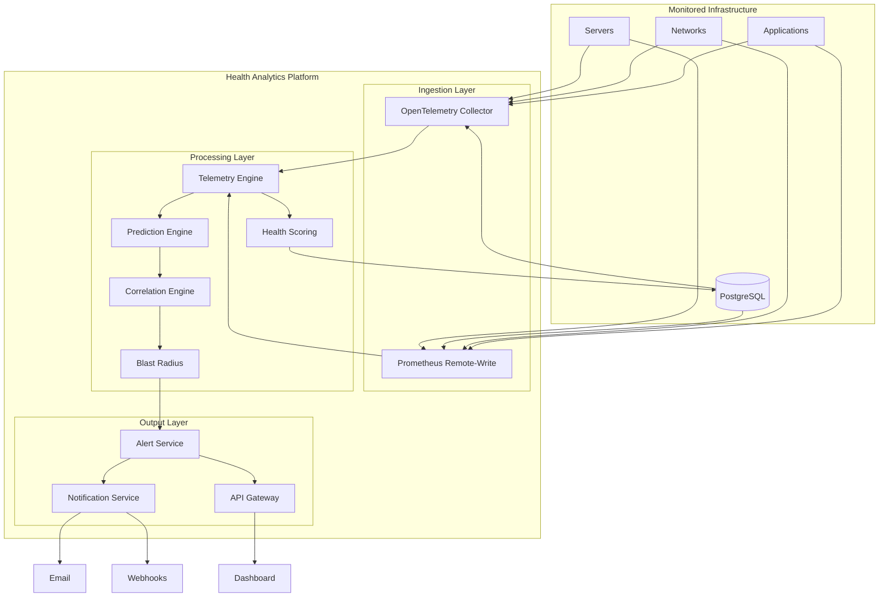
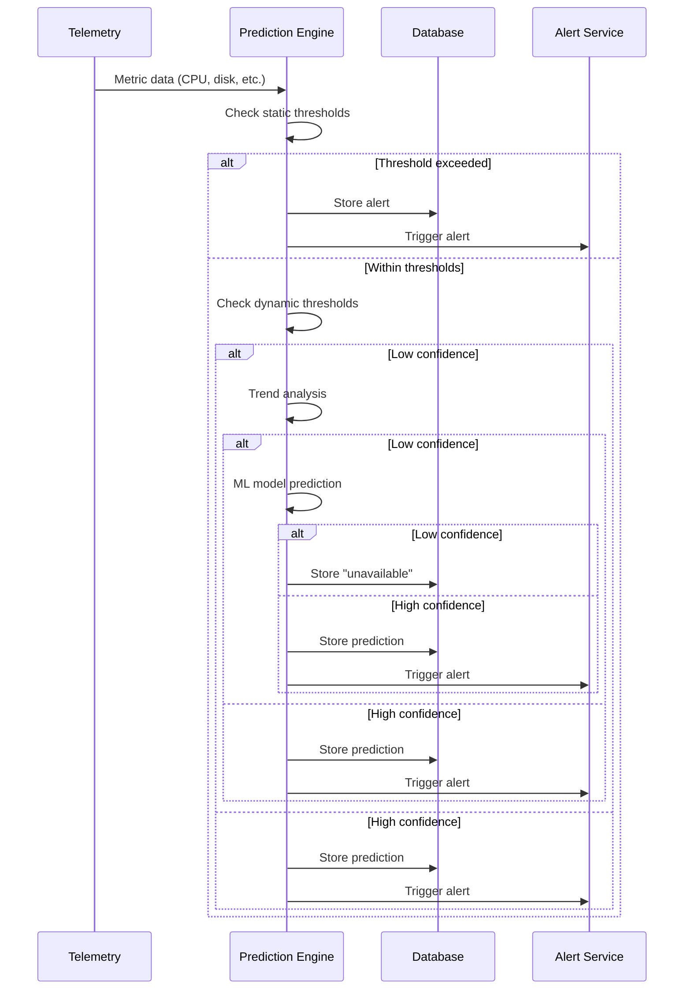

# Architecture Spine — Health Analytics Platform

## Invariants

### AD-01: Prediction Model Hierarchy

**Binds:** All prediction requests must follow the simple-first hierarchy.

**Rule:** Prediction engine evaluates in order: static thresholds → dynamic thresholds → trend analysis → ML models. Each level only runs if the previous level cannot produce a prediction with ≥70% confidence. If no level achieves minimum confidence threshold, display "Prediction unavailable — insufficient history" rather than a low-confidence estimate.

**Prevents:** Over-reliance on ML before sufficient training data exists; misleading predictions when historical context is lacking.

---

### AD-02: API Communication Protocol

**Binds:** All external-facing APIs and public contracts.

**Rule:** JSON over HTTP/HTTPS for all REST endpoints. Internal service-to-service communication may use gRPC for performance optimization, with JSON gateway for external clients.

**Prevents:** Client library fragmentation; ensures broad compatibility with existing monitoring tool integrations.

---

### AD-03: Collector Overhead Constraint

**Binds:** All telemetry collection components.

**Rule:** Collectors (sidecar, daemonset, or agent) must consume <2% CPU and <100MB RAM of the monitored host. Collection interval defaults to 10 seconds; may be configured per component type.

**Prevents:** Performance impact on production infrastructure; ensures adoption in performance-sensitive environments.

---

### AD-04: Overlay Intelligence Principle

**Binds:** Product positioning and integration design.

**Rule:** Platform operates as an overlay layer on existing monitoring tools (Datadog, Dynatrace, Splunk, Prometheus). It does NOT replace existing monitoring but augments with predictive capabilities. All integrations are read-only from source systems unless explicitly configured for webhook actions.

**Prevents:** Conflict with existing monitoring investments; reduces adoption friction.

---

### AD-05: Recommendation-Only Remediation

**Binds:** Alert and action handling.

**Rule:** Platform generates recommendations and suggested actions but never automatically executes remediation. All action execution remains under human control. Webhooks may trigger external automation but the platform itself does not initiate.

**Prevents:** Unintended production changes; builds trust with conservative operations teams.

---

## Seed

### Core Services

| Service | Responsibility | Technology |
|---------|---------------|------------|
| **API Gateway** | REST API entry point, auth, rate limiting | FastAPI / Kong |
| **Telemetry Ingestion** | Receive metrics via OTLP, Prometheus remote-write | OpenTelemetry Collector |
| **Health Scoring Engine** | Calculate component health scores (0-100) | Python/FastAPI |
| **Prediction Engine** | Time-to-breach predictions with confidence | Python (pandas, statsmodels) |
| **Alert Service** | Generate and manage alerts | Python/FastAPI |
| **Notification Service** | Deliver alerts via email, in-app, webhook | Python |
| **Correlation Engine** | Link related issues across layers | Python |
| **Blast Radius Service** | Compute downstream impact | Python |

### Data Model

```
Components
├── id (UUID)
├── name (string)
├── type (enum: server, database, network, application)
├── environment (string)
├── health_score (0-100)
├── last_updated (timestamp)
└── metadata (JSON)

Metrics
├── id (UUID)
├── component_id (FK)
├── metric_name (string)
├── value (float)
├── timestamp (timestamp)
└── labels (JSON)

HealthScores (history)
├── id (UUID)
├── component_id (FK)
├── score (0-100)
├── factors (JSON)
└── timestamp (timestamp)

Predictions
├── id (UUID)
├── component_id (FK)
├── metric_name (string)
├── time_to_breach_minutes (int)
├── confidence_percent (int)
├── model_used (string)
├── explanation (string)
└── timestamp (timestamp)

Alerts
├── id (UUID)
├── component_id (FK)
├── severity (enum: critical, warning, info)
├── title (string)
├── message (string)
├── time_to_breach (string)
├── confidence (string)
├── recommended_action (string)
├── status (enum: new, acknowledged, resolved)
├── created_at (timestamp)
└── resolved_at (timestamp)

Recommendations
├── id (UUID)
├── alert_id (FK)
├── action (string)
├── runbook_link (string)
├── priority (int)
└── executed (boolean)
```

### MVP Stack

| Layer | Technology |
|-------|------------|
| Frontend | React |
| Backend | FastAPI |
| Database | PostgreSQL |
| Telemetry | OpenTelemetry Collector |
| Alerting | Prometheus Alertmanager |
| ML/Analytics | pandas, statsmodels |

### Enterprise Stack (V2+)

| Layer | Technology |
|-------|------------|
| Deployment | Kubernetes |
| Message Queue | Apache Kafka |
| Time-Series DB | InfluxDB or TimescaleDB |
| Visualization | Grafana |
| ML Pipeline | Python (Prophet, scikit-learn) |

### Integration Points

| System | Method | Direction |
|--------|--------|-----------|
| Datadog | API / OpenTelemetry | Read |
| Dynatrace | API / OpenTelemetry | Read |
| Splunk | API / OpenTelemetry | Read |
| Prometheus | Remote-write | Read |
| PagerDuty | Webhook | Write |
| OpsGenie | Webhook | Write |
| ServiceNow | Webhook | Write |

### Webhook Payload Schema

All webhook integrations use the following standard payload format:

```json
{
  "alert_id": "uuid",
  "title": "string",
  "severity": "critical|warning|info",
  "component": "string",
  "message": "string",
  "time_to_breach": "string",
  "confidence": "string",
  "recommended_action": "string",
  "timestamp": "ISO8601",
  "links": {
    "dashboard": "url",
    "component_detail": "url"
  }
}
```

---

## Deferred

| Item | Reason |
|------|--------|
| Multi-cloud metric normalization | Requires customer-specific implementation; defer to V2 |
| RBAC implementation | Defer to V3; MVP uses simple auth |
| Multi-tenancy | Defer to V3; MVP single-tenant |
| Real-time streaming visualization | Defer to V2; MVP uses polling |

---

## Open Questions

| ID | Question | Owner |
|----|----------|-------|
| OQ-ARCH-01 | What is the minimum prediction confidence threshold to display? | Architecture |
| OQ-ARCH-02 | How to handle metric cardinality explosion at 500+ components? | Scalability |
| OQ-ARCH-03 | Which runbook systems to integrate first? | Engineering |

---

## Diagram: System Context



---

## Diagram: Prediction Flow



---

*Spine status: draft — ready for review*
*Next: bmad-spec to create companion spec, then bmad-create-epics-and-stories*